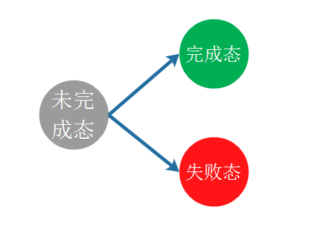

# 课程大纲
## 课前准备
- 课程中用到的数据接口

```
// 用户信息
http://rap2.taobao.org:38080/app/mock/252985/userInfo

// 用户账单
http://rap2.taobao.org:38080/app/mock/252985/bill?userId=1

// 手机
http://rap2.taobao.org:38080/app/mock/252985/mobilephone

// 电脑
http://rap2.taobao.org:38080/app/mock/252985/computer

// 电视机
http://rap2.taobao.org:38080/app/mock/252985/TV

```

- 简单封装一个ajax方法

```
/**
 * ajax方法接受一个obj对象
 * obj = {
 *  url:'', //请求接口地址
 *  success(data){}, //成功回掉
 *  fail(err){} //失败回掉
 * } 
 */
function ajax(obj) {
    let xhr = new XMLHttpRequest();
    xhr.open('get', obj.url, true);
    xhr.send();
    xhr.onreadystatechange = function () {
        if (xhr.readyState === 4 && xhr.status === 200) {
            let data = (JSON.parse(xhr.responseText));
            if(data.isOk === false){
                obj.fail ? obj.fail(data): null;
            }else{
                obj.success(data);
            }
        }
    }
}
```

## Promise基础
Promise 是异步编程的一种解决方案，比传统的解决方案（回调函数和事件）更合理和更强大。它由社区最早提出和实现，ES6将其写进了语言标准，统一了用法，并提供了原生的Promise。

在Promise之前，在js中的异步编程都是采用回调函数和事件的方式，但是这种编程方式在处理复杂业务的情况下，很容易出现callback hell（回调地狱），使得代码很难被理解和维护。

例如Ajax的回调问题，如果下一个ajax请求要用到上一个Ajax请求中的结果，那么就会导致多个回调嵌套的问题。

代码示例`ajax.html`：[点击查看源码](./demo/ajax.html)

### 1.理解Promise
Promise的使用语法：

```
// 以下是伪代码
var p = new Promise(function (resolve, reject) {
    // ...
    if(/* 异步操作成功 */){
        resolve(result);
    } else {
        reject(error);
    }
});

p.then(function (value) {
    // 完成态
}, function (error) {
    // 失败态
});
```

我们需要关注的点：

#### 1.1 传入构造函数的函数，及该函数的两个入参`resolve函数`和`reject函数`

在Promise中，对一个异步操作做出了抽象的定义，Promise操作只会处在3种状态的一种，他们之间的转化如图所示：



注意，这种状态的改变只会出现**从未完成态向完成态或失败态转化**，不能逆反。完成态和失败态不能互相转化，而且状态一旦转化，将不能更改。
只有**异步操作的结果可以决定当前是哪一种状态**，除此之外任何其他操作都无法改变这个状态。

在声明一个Promise对象实例时，需要向**Promise构造函数**中传入一个接受`resolve函数`和`reject函数`的匿名函数：

- 其中`resolve`用于触发完成态之后的操作
- 其中`reject`用于触发失败态之后的操作

#### 1.2 then()，及then的两个入参

代码示例：`Promise1.html`：[点击查看源码](./demo/Promise1.html)

#### 1.3 then的链式调用

代码示例：`Promise2.html`：[点击查看源码](./demo/Promise2.html)

### 用Promise封装ajax
代码示例：`Promise3.html`：[点击查看源码](./demo/Promise3.html)

### race方法和all方法
代码示例：`Promise4.html`：[点击查看源码](./demo/Promise4.html)

## Promise简单实现